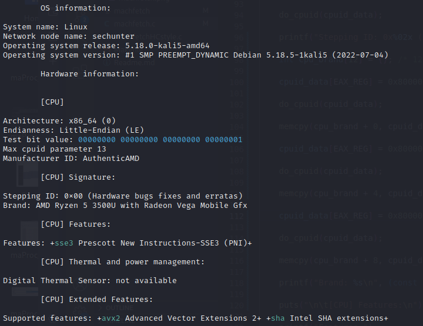

# machfetch

A simple fetch utility that can be used as information gathering tool

## Requirements

- The CPU must be compatible with the 'cpuid' instruction and work as expected

## How to compile

~~~bash
make
~~~

## How to run

~~~
./machfetch
~~~

